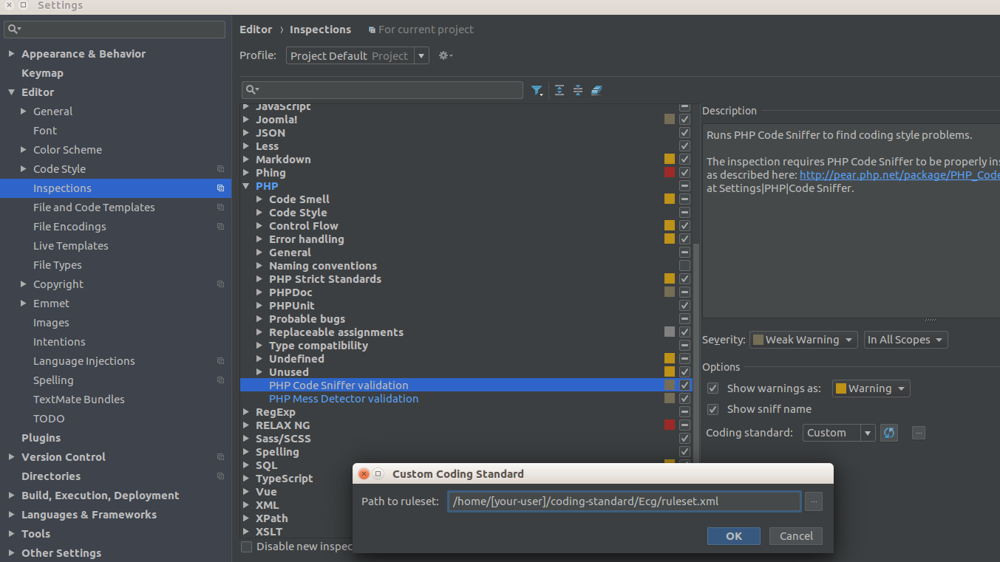
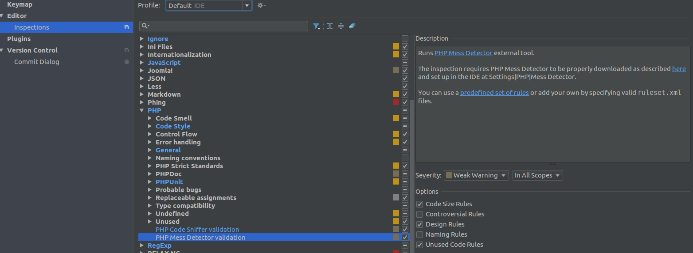

# Coding Standard Files #
This repository has files to use for code validation in PhpStorm and in Magento projects.

You'll need to clone this repository and https://github.com/onestic/coding-standard to your user root folder (/home/[your-user]/).
 
* Load _PhpStorm/PhpStorm-settings-codings-standards.jar_ from _"File > Import Settings..."_ option.
* Load _PhpStorm/PhpStorm-php-code-style.xml_ from _"File > Default Settings... / Settings..."_ and _"Editor > Code Style > Import Scheme > Intellij IDEA code style XML"_

Please check [Onestic Coding Standard](doc/onestic-coding-standards.md) document for more info about Onestic Standards.

## Code sniffer & Mess detector configurations ##

After load PhpStorm settings files you'll have enabled and configured Code Sniffer and Mess Detector to check your code.

To check both sniffers are installed correctly, or to enable them in already created PhpStorm project, check configuration in _"Settings > Editor > Inspections > Php"_ and check this options:

In Code Sniffer config, _"Coding Standard"_ is set to "Custom"_ value and in file selector modal, ruleset.xml file path is set to _/home/[your-user]/coding-standard/Ecg/ruleset.xml_


  
In Mess Detector config, check setted options are: 
- Code Size Rules
- Design Rules
- Unused Code Rules



You'll need to install some php packages in your environment to run phar files and read xml files from PhpStorm:
```shell
sudo apt-get install php7.0 php7.0-xml -y
```

## ESLint & JSHint ##

### Install Node.js and NPM ###
From https://www.npmjs.com/package/eslint

```shell
sudo apt-get install npm
npm install eslint --save-dev
```

## Errors installing management ##

### PhpStorm - Configure Node.js and NPM ###
https://www.jetbrains.com/help/phpstorm/2016.2/using-javascript-code-quality-tools.html#installESLint
https://stackoverflow.com/questions/36223947/webstorm-error-please-specify-npm-package#36261165

Fixing specific errors
```shell
npm install eslint-plugin-import
npm install eslint-plugin-node
npm install eslint-plugin-standard
npm install ...
```

## Update composer.json in Magento projects ##

Until Onestic repositories be updated, they'll be loaded from github url.

mnsami/composer-custom-directory-installer is used to add repo files to /tools folder with "installer-paths" extra params.

phpro/grumphp is added to check code before commit it config file is loaded as config-default-path param says.

squizlabs/php_codesniffer and phpmd/phpmd are added for use by grumphp.

So add this params to composer.json:

```json
  "repositories": [
    {
      "type": "vcs",
      "url": "https://github.com/onestic/coding-standard.git"
    },
    {
      "type": "vcs",
      "url": "https://github.com/onestic/coding-standard-files.git"
    }
  ],
  "require-dev": {
    "mnsami/composer-custom-directory-installer": "1.1.*",
    "onestic/coding-standard": "dev-master",
    "onestic/coding-standard-files": "dev-master",
    "phpmd/phpmd": "2.6.*",    
    "phpro/grumphp": "^0.14.0",    
    "squizlabs/php_codesniffer": "3.2.*"
  },
  "extra": {
    "installer-paths": {
      "./tools/coding-standard/": ["onestic/coding-standard"],
      "./tools/coding-standard-files/": ["onestic/coding-standard-files"]
    },
    "grumphp": {
      "config-default-path": "tools/coding-standard-files/grumphp/grumphp.yml"
    }
  },
```

And also remember to add this tools subfolders to project's .gitignore file:

```
tools/coding-standard
tools/coding-standard-files
```

## Grumphp ##

https://github.com/phpro/grumphp

Tool for validating your code before commit it to repository.

### Basic usage ###

Sniff commits

```shell
grumphp git:init
```

Stop sniffing commits

```shell
grumphp git:deinit
```
