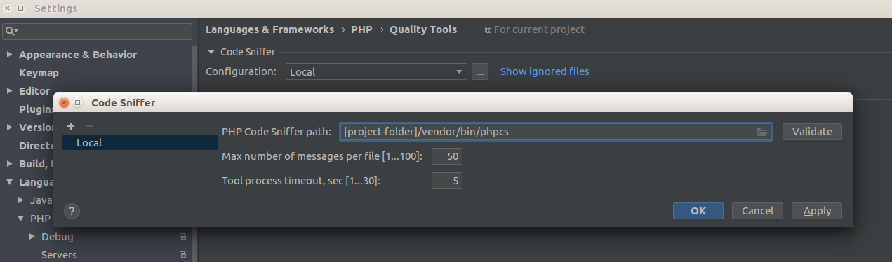
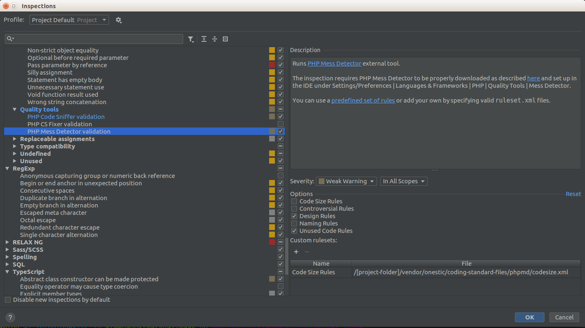

# Coding Standard Files #
This repository has files to use for code validation in PhpStorm and in Magento projects.

Please check [Onestic Coding Standard](doc/onestic-coding-standards.md) document for more info about Onestic Standards.

For applying most of defined format rules in PhpStorm, load _PhpStorm/PhpStorm-php-code-style.xml_ from _"File > Default Settings... / Settings..."_ and _"Editor > Code Style > Import Scheme > Intellij IDEA code style XML"_

This repositorty has Code Sniffer and Mess Detector recompiled phar files in bin/ folder in order to check phtml file in PhpStorm and Grumphp.

## Index

* [CS & MD in PhpStorm](#code-sniffer--mess-detector-configurations-in-phpstorm)

* [ESLint & JSHint](#eslint--jshint)

* [Grumphp](#grumphp)

* [Update composer.json in Magento projects](#update-composerjson-in-magento-projects)

* [Roadmap](#roadmap)

## Code Sniffer & Mess Detector configurations in PhpStorm ##

First you have to enable CS and MD in project configuration in _"Languages & Frameworks > Php > Quality tools"_ and set excutable files from _[project-folder]/vendor/onestic/coding-standard-files/bin/_ folder.




To set both sniffers check inspector configuration in _"Settings > Editor > Inspections > Php"_ and check this options:

In Code Sniffer config, _"Coding Standard"_ must be set to _"Custom"_ option and in file selector, ruleset.xml file path must be set to _[project-folder]/vendor/onestic/coding-standard/Ecg/ruleset.xml_


  
In Mess Detector config, check set options are:
 
- Code Size Rules

- Design Rules

- Unused Code Rules



You'll need to install some php packages in your environment to run phar files and read xml files from PhpStorm:
```shell
sudo apt-get install php7.0 php7.0-xml -y
```

## ESLint & JSHint ##

### Install Node.js and NPM ###
From https://www.npmjs.com/package/eslint

```shell
sudo apt-get install npm
npm install eslint --save-dev
```

### PhpStorm - Configure Node.js and NPM ###
https://www.jetbrains.com/help/phpstorm/2016.2/using-javascript-code-quality-tools.html#installESLint
https://stackoverflow.com/questions/36223947/webstorm-error-please-specify-npm-package#36261165

Fixing specific errors
```shell
npm install eslint-plugin-import
npm install eslint-plugin-node
npm install eslint-plugin-standard
npm install ...
```

## Grumphp ##

https://github.com/phpro/grumphp

Tool for validating your code before commit it to repository.

### Basic usage ###

Sniff commits

```shell
grumphp git:init
```

Stop sniffing commits

```shell
grumphp git:deinit
```

## Update composer.json in Magento projects ##

Until Onestic repositories be updated, they'll be loaded from github url.

phpro/grumphp is added to check code before commit it config file is loaded as config-default-path param says.


So add this params to composer.json:

```json
  "repositories": [
    {
      "type": "vcs",
      "url": "https://github.com/onestic/coding-standard.git"
    },
    {
      "type": "vcs",
      "url": "https://github.com/onestic/coding-standard-files.git"
    }
  ],
  "require-dev": {
    "onestic/coding-standard": "dev-master",
    "onestic/coding-standard-files": "dev-master",
    "phpro/grumphp": "^0.14.0",    
  },
  "extra": {
    "grumphp": {
      "config-default-path": "vendor/onestic/coding-standard-files/grumphp/grumphp.yml"
    }
  },
```

## Roadmap ##

Please check [Onestic Coding Standard](doc/roadmap.md)