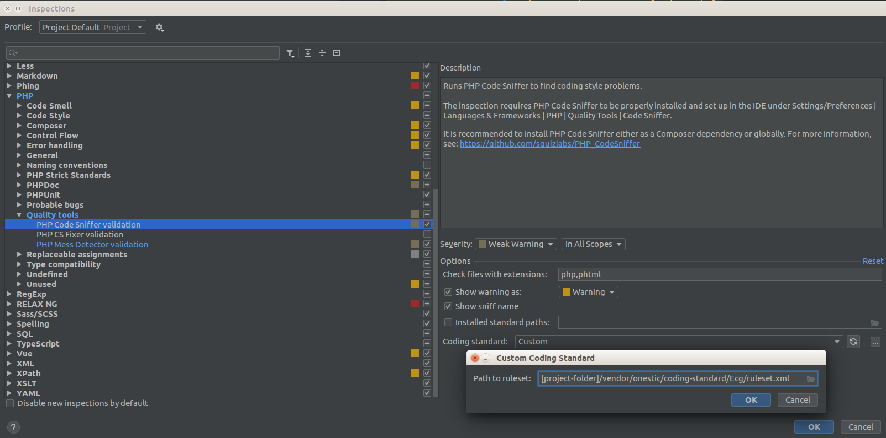

# Coding Standard Files #
This repository has files to use for code validation in PhpStorm and in Magento projects.

Please check [Onestic Coding Standard](doc/onestic-coding-standards.md) document for more info about Onestic Standards.

For applying most of defined format rules in PhpStorm, load _PhpStorm/PhpStorm-php-code-style.xml_ from _"File > Default Settings... / Settings..."_ and _"Editor > Code Style > Import Scheme > Intellij IDEA code style XML"_

Note this repository has Code Sniffer and Mess Detector recompiled phar files in bin/ folder in order to check phtml files in PhpStorm and Grumphp.

## Index

* [Update composer.json in Magento projects](#update-composerjson-in-magento-projects)

* [CS & MD in PhpStorm](#code-sniffer--mess-detector-configurations-in-phpstorm)

* [Grumphp](#grumphp)

* [ESLint & JSHint](#eslint--jshint)

* [Application cases](#application-cases-for-coding-standards)

* [Roadmap](doc/roadmap.md)

## Update composer.json in Magento projects ##

This Coding Standards currently apply on Magento 1 projects, so they have been loaded in composer.json project: 

```json
  "repositories": [
    {
      "type": "vcs",
      "url": "https://github.com/onestic/coding-standard.git"
    },
    {
      "type": "vcs",
      "url": "https://github.com/onestic/coding-standard-files.git"
    }
  ],
  "require-dev": {
    "onestic/coding-standard": "dev-master",
    "onestic/coding-standard-files": "dev-master"
  },
```

## Code Sniffer (CS) & Mess Detector (MD) configurations in PhpStorm ##

First you have to enable CS and MD in project configuration in _"Languages & Frameworks > Php > Quality tools"_ and set executable files from _[project-folder]/vendor/bin/_ folder.


In old PhpStorm versions, CS and MD configurations are managed from _"Php > Code Sniffer"_ and _"Php > Mess Detector"_ options.


To set both sniffers check inspector configuration in _"Settings > Editor > Inspections > Php"_ and check this options:

1 - In Code Sniffer config, _"Coding Standard"_ option must be set to _"Custom"_ and in file selector, ruleset.xml file path must be set to _[project-folder]/vendor/onestic/coding-standard/Ecg/ruleset.xml_

In option block _"Check files with extension"_ set value _php,phtml_ for sniffing this files (old PhpStorm versions doesn't have this extension management or have checkboxes to set extensions).


  
2 - In Mess Detector config, check set options are:
 
- Design Rules

- Unused Code Rules

And set Code Size Rules from our custom ruleset in: _[project-folder]/vendor/onestic/coding-standard-files/phpmd/codesize.xml_


Maybe you'll need to install some php packages in your environment to run phar files and read xml files from PhpStorm:

```shell
sudo apt-get install php7.0 php7.0-xml -y
```

## Grumphp ##

https://github.com/phpro/grumphp

Grumphp is a tool for validating your code before commit it to repository.

Before installing, add this config to composer.json project:

```json
  "extra": {
    "grumphp": {
      "config-default-path": "vendor/onestic/coding-standard-files/grumphp/grumphp.yml"
    }
  },
```

Then install it with ```composer require --dev phpro/grumphp```

Remember: phpmd and phpcs bin files used by Grumphp will be our recompiled phar files from this repository.

### Basic usage ###

Sniff commits

```shell
grumphp git:init
```

Stop sniffing commits

```shell
grumphp git:deinit
```

If calling directly to _grumphp_ doesn't work, call it with:

```shell
vendor/bin/grumphp [command]
``` 

## ESLint & JSHint ##

ESLint and JSHints validation are in progress of definition, but until then, you can try our current rules: 

### Install Node.js and NPM ###
From https://www.npmjs.com/package/eslint

```shell
sudo apt-get install npm
npm install eslint --save-dev
```

### PhpStorm - Configure Node.js and NPM ###
https://www.jetbrains.com/help/phpstorm/2016.2/using-javascript-code-quality-tools.html#installESLint
https://stackoverflow.com/questions/36223947/webstorm-error-please-specify-npm-package#36261165

Fixing specific errors
```shell
npm install eslint-plugin-import
npm install eslint-plugin-node
npm install eslint-plugin-standard
npm install ...
```

## Application cases for coding standards ##

If you're working in an old project or third party code, maybe you shouldn't apply our coding standards in order to keep consistency in code style. But whenever you can you must clean al mess code you found.

If you're working in a new module you must use all this rules.

If some rules doesn't fit with what you want to do or if you're missing some rules, feel free to PR.

Also you can ask to your teach lead for help working with them :)   

And of course: __Feedback is welcome!__
